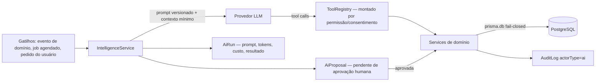

# AI_ARCHITECTURE — módulo `intelligence`

A IA do Veyra é um módulo estrutural, não um chat decorativo. Para o usuário ela aparece como **sinais, insights e próximas ações** dentro do fluxo de trabalho; para a arquitetura, é um consumidor disciplinado dos serviços de domínio.

## 1. Princípios

1. **IA não acessa o banco.** O módulo `intelligence` nunca importa o Prisma. Toda leitura e toda ação passam por **tools** que chamam serviços de domínio.
2. **Tools herdam tudo.** Por chamarem services que usam `prisma.db`, as tools herdam automaticamente isolamento de workspace, RBAC (rodam no contexto da membership que disparou) e auditoria. Uma tool nunca amplia o que o usuário já pode fazer.
3. **Capacidade ausente, não check escondido.** O ToolSet é montado condicionalmente pelas permissões do usuário e pelos consentimentos do workspace (`AiConsent`). Sem permissão/consentimento, a tool **não existe** no set — não é um `if` dentro do `execute`. O system prompt reflete o que está disponível.
4. **Aprovação humana no MVP.** Nenhuma ação externa (enviar mensagem, alterar deal, criar tarefa em nome de alguém) é executada diretamente: vira `AiProposal` pendente, aprovada/rejeitada por quem tem `intelligence:approve`.
5. **Tudo registrado.** Todo run persiste `AiRun`: capacidade, `promptVersion`, modelo, resumo mínimo de contexto (nunca payload bruto), tokens de entrada/saída, `costCents`, latência, resultado e ação tomada. Custo é agregável por workspace desde o primeiro run (base de quota `UsageLimit`).
6. **O produto funciona sem IA.** Sem API key ou com quota estourada, cada capacidade tem fallback determinístico ou degrada para "indisponível" — nunca quebra o fluxo.
7. **Loops limitados.** Execução agêntica com teto de passos (`stopWhen`), timeout e orçamento de tokens por run; cancelamento aborta a geração (para de faturar).

## 2. Arquitetura

Componentes do módulo (`apps/api/src/intelligence/` na Fase 2):

| Componente            | Responsabilidade                                                                                                                       |
| --------------------- | -------------------------------------------------------------------------------------------------------------------------------------- |
| `IntelligenceService` | Orquestra runs: monta contexto mínimo, escolhe prompt versionado, chama o LLM, persiste `AiRun`                                        |
| `ToolRegistryService` | `build({ membership, consents })` → ToolSet condicional; cada tool = descrição + `inputSchema` Zod + `execute` que delega a um service |
| `ProposalService`     | Ciclo de vida de `AiProposal` (pending → approved/rejected/expired); execução aprovada delega ao service de domínio e audita           |
| `PromptRegistry`      | Prompts versionados (`PromptVersion`: capability, version, hash, changelog) — mudar prompt = nova versão, nunca edição silenciosa      |
| `CostService`         | Agrega tokens/custo por workspace; alimenta quotas                                                                                     |
| `evals/`              | Avaliações automatizadas por capacidade                                                                                                |

Nota de engenharia (herdada do Norteie): tipar o ToolSet explicitamente — a inferência profunda de generics de AI SDK + Zod estoura a memória do `tsc`.

## 3. Capacidades iniciais (contratos)

| #   | Capacidade                  | Entrada                              | Saída                                                                                           | Ação externa?                   |
| --- | --------------------------- | ------------------------------------ | ----------------------------------------------------------------------------------------------- | ------------------------------- |
| 1   | **Resumo de conversa**      | conversationId                       | Resumo estruturado (participantes, assunto, pendências, sentimento)                             | Não                             |
| 2   | **Extração de intenção**    | mensagem/conversa                    | Intenção classificada (catálogo: comprar, cancelar, dúvida, reclamação…) + confiança            | Não                             |
| 3   | **Sugestão de resposta**    | conversationId + contexto do contato | Rascunho de resposta (tom do workspace)                                                         | Sim → `AiProposal` (enviar)     |
| 4   | **Próxima ação**            | contactId ou dealId                  | Ação recomendada + justificativa (ligar, agendar, proposta…)                                    | Sim → `AiProposal` (criar task) |
| 5   | **Lead scoring explicável** | contactId/dealId                     | Score 0–100 + **fatores explicáveis** (recência, engajamento, fit, estágio) — nunca score opaco | Não                             |
| 6   | **Oportunidade parada**     | job periódico por workspace          | Deals com `stalledSince` acima do limiar + motivo provável + próxima ação                       | Sim → `AiProposal`              |
| 7   | **Limpeza de dados**        | job/pedido                           | Duplicatas prováveis, campos inconsistentes, sugestão de merge                                  | Sim → `AiProposal` (merge)      |
| 8   | **Previsão de pipeline**    | pipelineId + período                 | Forecast com intervalos + premissas explicitadas                                                | Não                             |

Capacidades 5–8 preferem sinais determinísticos calculáveis sem LLM (recência, valores, movimentação) com o LLM por cima para explicação/síntese — barato, testável, e o fallback já existe.

## 4. Dados e privacidade

- **Contexto mínimo**: cada capacidade declara exatamente que campos entram no prompt (allowlist, como na auditoria). Conteúdo de conversa só entra com consentimento (`AiConsent`) do workspace.
- `AiRun.contextSummary` guarda a descrição do contexto (quais entidades/campos), não o payload.
- Dados de workspace nunca treinam modelos; provedor com zero data retention preferido.
- Runs disparados por job usam membership de serviço com permissões mínimas da capacidade.

## 5. Evals

- Cada capacidade tem fixtures (cenários sintéticos por workspace de teste) + assertions: formato da saída (Zod), critérios objetivos (intenção correta no catálogo, fatores de score presentes, resumo cobre pendências).
- Evals rodam em CI contra fixtures gravadas (sem chamar LLM em PR comum) e em suite agendada contra o provedor real quando `promptVersion` muda.
- Regressão de eval bloqueia bump de `promptVersion`.

## 6. Quotas e custo

- `costCents` por run → `UsageCounter(metric: 'ai_runs' | 'ai_cost_cents')` por período.
- Quota por plano; estourou = capacidade indisponível com mensagem clara (nunca cobrar surpresa, nunca falhar silencioso).
- Alertas de custo anômalo por workspace (job).

## 7. O que a IA nunca faz

- Acessar Prisma/banco/SQL diretamente.
- Executar ação externa sem `AiProposal` aprovada (MVP).
- Ver dados fora do workspace do run ou além das permissões da membership.
- Operar sem registro de `AiRun`.
- Aparecer no produto como chat genérico desacoplado do fluxo de trabalho.
