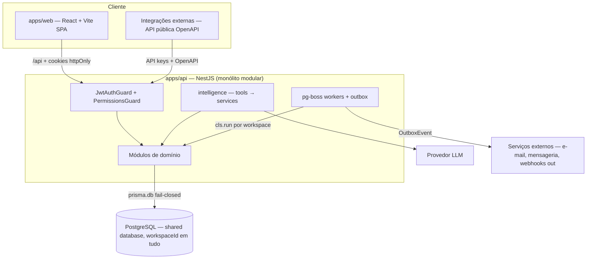
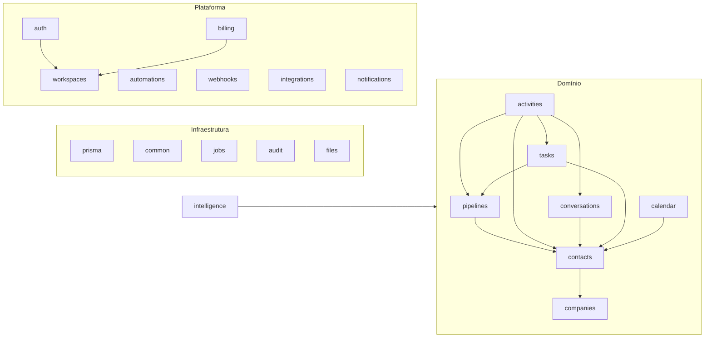

# ARCHITECTURE — Veyra

## 1. Estilo arquitetural

**Monólito modular** (ADR-001): uma API NestJS com módulos de domínio bem delimitados, um SPA React, um Postgres. Sem microsserviços, sem event bus distribuído, sem camadas genéricas (Repository, "core utils") sem necessidade demonstrada em ADR. A modularidade vem de boundaries de import explícitos entre módulos — não de processos separados.

## 2. Visão de contêineres



## 3. Camadas dentro da API

```
Request
  → JwtAuthGuard (global; valida JWT, revalida tokenVersion da membership,
                  seta workspaceId/userId/membershipId no CLS)
  → PermissionsGuard (global; checa @RequirePermissions() contra as permissões do role)
  → ZodPipe (valida body/query contra schema de packages/contracts)
  → Controller (rota + validação; zero lógica de negócio)
  → Service (regra de negócio, auditoria, outbox)
  → PrismaService.db (client extension: filtro automático por workspaceId, fail-closed)
  → PostgreSQL
```

Regras:

- Controllers finos; toda regra vive em services.
- **Sem camada Repository** (ADR-005): se um service cresce demais, divida em dois services.
- Endpoints são privados por padrão (guard global); exceção via `@Public()` explícito.

## 4. Multi-tenancy (resumo — detalhe em SECURITY.md)

- Toda entidade de domínio tem `workspaceId` e entra no set `WORKSPACE_MODELS`.
- `PrismaService` expõe `db` (extension que injeta `workspaceId` em creates, `AND: [{workspaceId}, where]` em queries, bloqueia `findUnique`/`update`/`delete`/`upsert` e **lança erro** sem workspace no CLS) e `raw` (sem filtro, uso excepcional documentado).
- `raw` restrito a: identidade global (User/RefreshToken), autenticação, provisionamento controlado, jobs cross-workspace, rotinas administrativas justificadas.
- FKs compostas garantem integridade cross-workspace no banco (`FOREIGN KEY (workspaceId, xId) REFERENCES X(workspaceId, id)`).
- Defesa em profundidade futura: RLS no Postgres (ADR adiado com gatilho).

## 5. Módulos do Core e grafo de dependências

Módulos previstos em `apps/api/src/`:

`auth`, `workspaces` (workspace, membership, role, team, invite), `contacts`, `companies`, `custom-fields`, `pipelines` (pipeline, stage, deal), `tasks`, `notes`, `activities` (timeline), `conversations` (conversation, message, channel), `calendar`, `notifications`, `files`, `automations`, `webhooks`, `integrations`, `audit`, `billing`, `intelligence`, `jobs`, `prisma`, `common`.

Regras de dependência:



- Módulos de domínio **não se importam lateralmente de forma ad-hoc**; aresta nova estrutural exige ADR.
- `integrations`/`webhooks` são infraestrutura de borda: nunca dependem de módulos de domínio específicos além dos contratos que expõem.
- `intelligence` depende de services de domínio (via tools) — nunca do Prisma.
- Nenhum módulo do Core importa nada de um vertical.

## 6. Estratégia de verticais

Um vertical (ex.: `@veyra/clinics`) é um conjunto de módulos NestJS + telas que:

1. **Estende entidades por extension table 1:1**: `ClinicsPatient(workspaceId, contactId → Contact, ...)` com `@@unique([workspaceId, contactId])` e FK composta. Ler "paciente" = join da extensão com o contato.
2. **Usa custom fields do Core** para atributos simples sem estrutura própria.
3. **Adiciona entidades próprias** (unidade, serviço clínico) — tenant-scoped, mesmas convenções do Core, registradas no `WORKSPACE_MODELS` do vertical.
4. **Compõe no bootstrap**: o app final importa `CoreModule` + `ClinicsModule`. O Core não tem plugin registry consciente de domínios; a composição é do produto final.
5. **Parametriza capacidades do Core**: automações (confirmação/no-show), agenda (slots clínicos), IA (reativação de pacientes) — via APIs públicas dos services do Core.

Direção de dependência: vertical → Core. Nunca o contrário. A skill `create-vertical` operacionaliza este checklist.

## 7. Contratos

- **Internos** (`packages/contracts`): schemas Zod para entrada (`createContactSchema` → `CreateContactInput`) e interfaces TS para saída (`ContactDto`). Backend valida com `ZodPipe`; frontend importa tipos. Fonte única, checada em compile-time nos dois lados.
- **API pública**: OpenAPI gerado a partir dos controllers/schemas (ADR-006), versionada (`/api/v1`), autenticada por API key por workspace com escopos = permissões RBAC.
- Ordem de implementação: `packages/contracts` → `apps/api` → `apps/web`.

## 8. Jobs, outbox e efeitos externos

- **pg-boss** no mesmo Postgres (ADR-007). Kill switch `DISABLE_JOBS`.
- Jobs cross-workspace usam o padrão `runForAllWorkspaces`: itera workspaces via `raw` (justificado) e abre `cls.run()` com o `workspaceId` de cada um, try/catch por workspace — falha de um não derruba os outros.
- **Outbox transacional**: efeito externo (webhook out, e-mail, mensagem) nunca é disparado na transação de domínio. A transação grava `OutboxEvent`; um worker pg-boss entrega com retry/backoff exponencial e idempotência (`dedupeKey` + unique tenant-scoped, capturando P2002).
- **Idempotência HTTP**: endpoints de mutação da API pública aceitam `Idempotency-Key` (armazenada por workspace com TTL).

## 9. Observabilidade

- Logging estruturado (pino) com `requestId` correlacionado, `workspaceId`/`userId` do CLS; **nunca** logar payloads sensíveis ou segredos.
- Filtro global de exceções captura só 5xx (4xx é contrato) e enriquece com rota registrada (sem query string).
- Error tracking (Sentry-compatível) inerte sem DSN, com `sendDefaultPii: false`.
- Healthcheck público `GET /api/health`.
- Métricas e tracing: adiados com gatilho (ADR) — primeiro logs bons.

## 10. Frontend

- SPA React + Vite; estado de servidor em TanStack Query, estado de UI em store leve — nunca duplicar estado de servidor.
- Tabelas densas com TanStack Table; formulários com React Hook Form + resolvers Zod dos contratos.
- `lib/api.ts` é o único lugar com fetch; auth por cookies httpOnly (refresh automático em 401 com deduplicação de refresh concorrente).
- Componentes: primitivos acessíveis Radix/shadcn à la carte em `components/ui/`; componentes de domínio por pasta. Direção visual em `docs/DESIGN_DIRECTION.md`.

## 11. Padrões utilizados (e onde)

| Padrão | Onde | Por quê |
|---|---|---|
| Client extension fail-closed | `prisma.service.ts` | Isolamento na camada de dados, não na disciplina |
| Guard global + opt-out | `JwtAuthGuard` + `@Public()` | Seguro por default |
| Outbox | mutações com efeito externo | Atomicidade domínio+efeito |
| Dedupe key | notificações, outbox, webhooks | Idempotência barata via unique |
| Extension table 1:1 | verticais | Estender sem tocar o Core |
| CLS (AsyncLocalStorage) | request e jobs | Contexto de tenant sem passar parâmetro |
| ADR numerado | `docs/DECISIONS.md` | Decisão rastreável no código |
