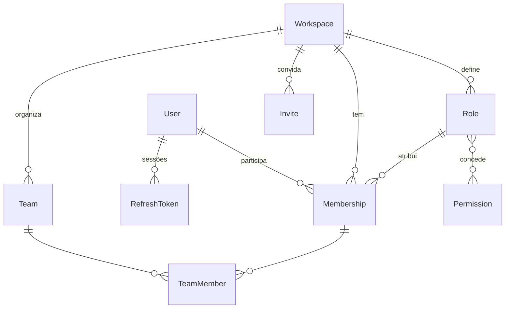
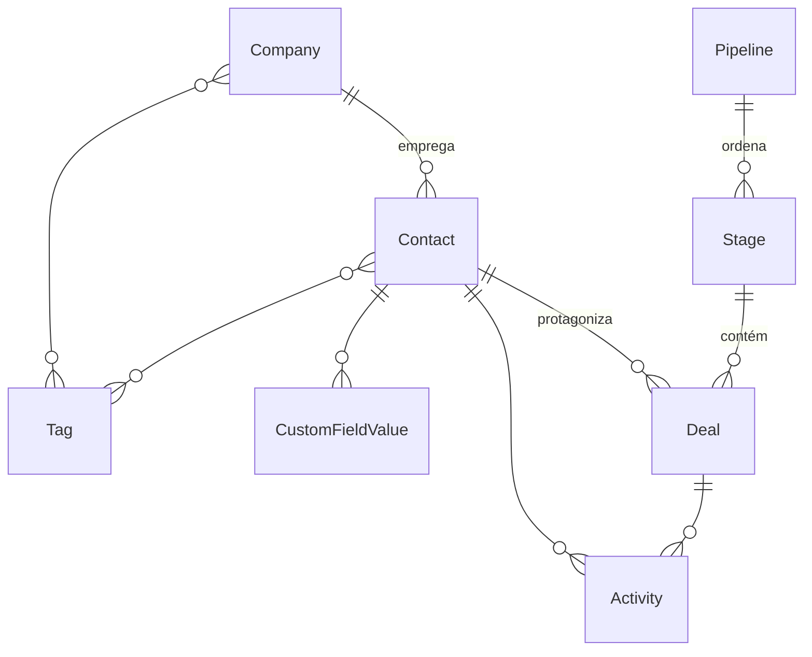

# DOMAIN_MODEL — Veyra Core

Modelo inicial. Nomes de entidades em inglês (código), descrições em pt-BR. Nada aqui é migration ainda — o schema Prisma só nasce na Fase 2.

## 1. Convenções

- IDs: `String @id @default(uuid()) @db.Uuid`.
- `createdAt @default(now())` + `updatedAt @updatedAt` em tudo.
- Toda entidade de domínio: `workspaceId String @db.Uuid` obrigatório, relação com `Workspace` com `onDelete: Cascade`, índices compostos liderados por `workspaceId` (`@@index([workspaceId, ...])`), uniques tenant-scoped (`@@unique([workspaceId, ...])`).
- Toda entidade referenciável por outra entidade de workspace declara `@@unique([workspaceId, id])` para permitir **FKs compostas** (`FOREIGN KEY (workspaceId, xId) REFERENCES X(workspaceId, id)`) — impedindo relações cross-tenant no próprio banco.
- Dinheiro: `Int` em centavos + `currency` (ISO 4217).
- Sem soft delete genérico; `archivedAt`/`status` onde fizer sentido; exclusão LGPD via cascade a partir de `Workspace` (e de `User` para dados globais).

## 2. Identidade e acesso

| Entidade | Escopo | Campos-chave | Notas |
|---|---|---|---|
| `User` | **Global** | email único, name, passwordHash, status | Sem `workspaceId`. Acesso via `raw` justificado |
| `RefreshToken` | Global | userId, tokenHash (SHA-256) único, expiresAt, revokedAt | Rotação real: refresh usado é revogado |
| `Workspace` | — | name, slug único, status, settings | Raiz do tenant; cascade para tudo |
| `Membership` | Workspace | userId, workspaceId, roleId, status (active/suspended/removed), **tokenVersion** | Tenant-scoped. `@@unique([workspaceId, userId])`. `tokenVersion` invalida sessões em revogação/mudança de permissão |
| `Role` | Workspace | name, isSystem, description | **Sempre do workspace**. Padrões (Owner/Admin/Member/Guest) semeados no provisionamento com `isSystem=true` (não editáveis/deletáveis). Não existe Role global |
| `Permission` | **Global (catálogo)** | key estável (`contacts:read`, `deals:write`, `settings:billing`…) | Exceção documentada à regra do workspaceId: é catálogo do sistema, não dado do tenant |
| `RolePermission` | Workspace | roleId (FK composta), permissionKey | Junção role↔permissão |
| `Team` | Workspace | name | `TeamMember` liga a `Membership` com FK composta |
| `Invite` | Workspace | email, roleId (FK composta), tokenHash, expiresAt, acceptedAt | Sem registro público: convite é a porta de entrada |

JWT: `sub` (userId), `membershipId`, `workspaceId` ativo, `tokenVersion`. Troca de workspace reemite token.

## 3. Relacionamento (CRM)

| Entidade | Campos-chave | Notas |
|---|---|---|
| `Contact` | name, emails[], phones[], companyId?, ownerId? (membership, FK composta), source, status | A entidade que verticais estendem (ex.: paciente) |
| `Company` | name, domain, size, ownerId? | |
| `Tag` | name, color, `@@unique([workspaceId, name])` | Junções `ContactTag`/`CompanyTag` com FKs compostas |
| `CustomFieldDefinition` | entityType (contact/company/deal), key, label, type (text/number/date/select/multiselect/boolean), options, required | Definição por workspace |
| `CustomFieldValue` | definitionId (FK composta), entityId + entityType, value (JSONB validado pelo type) | Único mecanismo "genérico" permitido — e mesmo assim tenant-scoped e tipado pela definição |
| `Pipeline` | name, isDefault | |
| `Stage` | pipelineId (FK composta), name, order, probability?, type (open/won/lost) | |
| `Deal` | title, pipelineId, stageId, contactId?, companyId?, ownerId?, amountCents, currency, expectedCloseDate, status, stalledSince? | FKs compostas para Pipeline/Stage/Contact/Company. Base do lead scoring e da previsão de pipeline |

## 4. Trabalho e timeline

| Entidade | Campos-chave | Notas |
|---|---|---|
| `Task` | title, description, dueAt, assigneeId? (membership), status, priority, contactId?, dealId? | FKs compostas nas referências |
| `Note` | body, authorId (membership), contactId?, companyId?, dealId? | |
| `Activity` | type (enum: task_completed, deal_moved, note_added, message_sent, meeting_held, file_attached, ai_action, …), actorType (user/ai/system/api), actorId?, occurredAt, payload mínimo, **contactId?, companyId?, dealId?, conversationId?, taskId?** | **Sem relação polimórfica sem integridade**: referências são colunas FK opcionais tipadas, todas com FK composta (workspaceId, x). Associações mais genéricas só futuramente, e apenas se preservarem FKs e isolamento (registrar em ADR) |

A timeline de um contato/deal é a consulta de `Activity` pelos FKs explícitos — auditável e tenant-safe.

## 5. Comunicação

| Entidade | Campos-chave | Notas |
|---|---|---|
| `Channel` | type (email/whatsapp/sms/webchat/internal), name, config (sem segredos — credenciais em `IntegrationCredential` cifrada), status | |
| `Conversation` | channelId (FK composta), contactId? (FK composta), subject?, status (open/pending/closed), assigneeId?, lastMessageAt | |
| `Message` | conversationId (FK composta), direction (in/out), authorType (contact/user/ai/system), authorId?, body, attachments (FileObject refs), deliveredAt, externalId? | `@@unique([workspaceId, channelId, externalId])` para dedup de ingestão |

## 6. Organização

| Entidade | Campos-chave | Notas |
|---|---|---|
| `CalendarEvent` | title, startAt, endAt, organizerId (membership), contactId?, dealId?, location?, status | Verticais especializam (agenda clínica) sem tocar esta entidade |
| `Notification` | recipientId (membership, FK composta), type, payload, readAt, **dedupeKey** | `@@unique([workspaceId, dedupeKey])` — idempotência |
| `FileObject` | key (storage prefixado por workspace), fileName, mimeType detectado por magic bytes, sizeBytes, uploadedById, scanStatus (pending/clean/quarantined) | Política completa em SECURITY.md §7 |

## 7. Plataforma

| Entidade | Campos-chave | Notas |
|---|---|---|
| `Automation` | name, trigger (evento de domínio), conditions, actions, enabled | v1: triggers/ações de catálogo fechado |
| `Webhook` | url, events[], secret cifrado, status | Entrega via outbox, assinatura HMAC |
| `Integration` / `IntegrationCredential` | provider, status / credenciais cifradas AES-256-GCM | Sem SDK pesado por padrão |
| `ApiKey` | name, keyHash, scopes (permission keys), lastUsedAt, revokedAt | API pública |
| `AuditLog` | actorType (user/ai/system/api), actorId?, action, entityType, entityId, before/after (allowlist + redaction), requestId, createdAt | Append-only; retenção em SECURITY.md |
| `OutboxEvent` | eventType, payload, dedupeKey, status (pending/delivered/failed), attempts, nextRetryAt | Gravado na transação de domínio |
| `IdempotencyKey` | key, requestHash, responseSnapshot, expiresAt | `@@unique([workspaceId, key])` |
| `Plan` (global, catálogo) / `Subscription` / `UsageLimit` / `UsageCounter` | — / planId, status, período / metric, limit / metric, period, value | Billing e quotas por workspace. `Plan` é catálogo global como `Permission` |

## 8. Inteligência

| Entidade | Campos-chave | Notas |
|---|---|---|
| `AiRun` | capability, promptVersion, model, contextSummary (mínimo, sem payload bruto), inputTokens, outputTokens, costCents, latencyMs, result (ok/error/refused), actionTaken (none/proposed/executed), triggeredByType/Id | Todo run persiste isto — base de custo por workspace e de evals |
| `AiProposal` | runId, type (send_message/update_deal/create_task/…), payload, status (pending/approved/rejected/expired), reviewedById, reviewedAt | MVP: toda ação externa passa por aqui |
| `PromptVersion` | (catálogo global) capability, version, hash, changelog | Prompt versionado fora do código de negócio |
| `AiConsent` | flags de consentimento por workspace (ex.: usar conteúdo de conversas) | Padrão opt-in: capacidade ausente ≠ check no execute |

## 9. O que NÃO é modelado (deliberadamente)

- Qualquer conceito vertical: paciente, prontuário, imóvel, visitante, matrícula, apólice.
- Role global ou "super-admin de produto" no modelo de tenant (operação administrativa é rotina `raw` justificada, fora do RBAC de workspace).
- Relações polimórficas sem FK (`entityType + entityId` soltos) — exceto `CustomFieldValue` e `AuditLog`, que são tenant-scoped, não navegáveis e existem exatamente para isso.
- Event sourcing, CQRS, filas distribuídas.
- Registro público de usuário.
